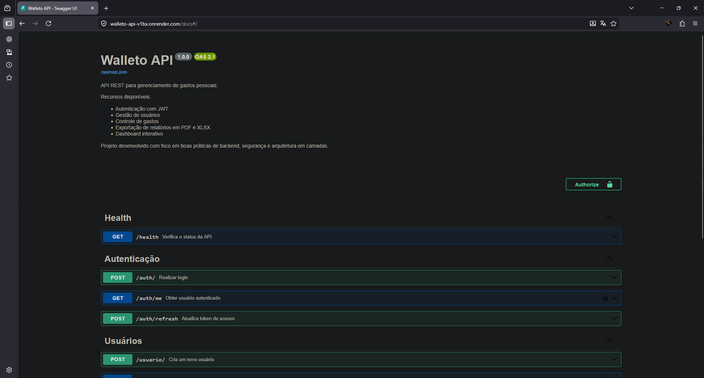
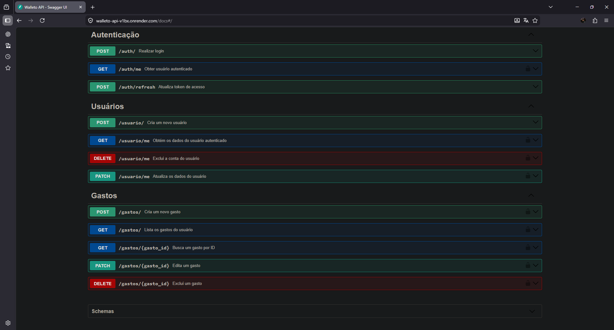
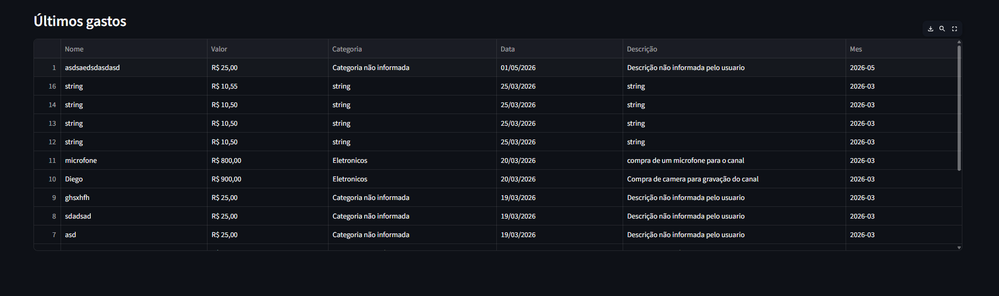
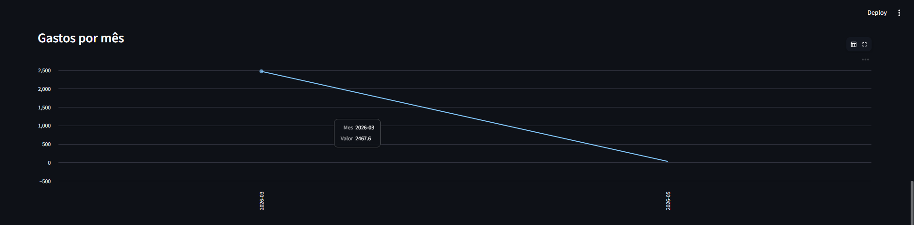

# 💰 Walleto API

API REST para gerenciamento de gastos pessoais, desenvolvida com foco em organização, escalabilidade e boas práticas de backend.

---

## 📸 Preview

### 🔧 API (Swagger)



### 📊 Dashboard (em desenvolvimento)




> ⚠️ O dashboard está em evolução e será disponibilizado em ambiente próprio nas próximas versões.

---

## 🚀 Sobre o projeto

O **Walleto API** é a evolução do projeto original **Walleto**, transformando uma aplicação local em um backend completo, preparado para integrações com aplicações web, mobile e dashboards.

A API centraliza todas as regras de negócio e expõe funcionalidades através de endpoints bem definidos, seguindo princípios de arquitetura em camadas.

---

## 🎯 Objetivo

- Centralizar regras de negócio em um backend robusto
- Expor funcionalidades via API REST
- Facilitar integração com frontends e serviços externos
- Melhorar escalabilidade e manutenção do sistema
- Servir como base para expansão do ecossistema Walleto

---

## ⚙️ Funcionalidades

- 🔐 Autenticação com JWT
- 🔄 Refresh Token
- 👤 Gestão de usuários
- 💸 CRUD de gastos
- 🔎 Filtros avançados de consulta
- 🚦 Rate Limiting
- 🧪 Testes automatizados com pytest
- 🔁 CI/CD com GitHub Actions

---

## 🧱 Arquitetura

O projeto segue uma arquitetura em camadas:

- **API (routes)** → entrada da aplicação
- **Services** → regras de negócio
- **Repositories** → acesso a dados
- **Models** → entidades
- **Validators** → validações de domínio
- **Infrastructure** → integrações externas (exportação e dashboard)
- **Core** → configurações e banco
- **Utils** → utilitários

---

## 🗂 Estrutura do projeto

```bash
src/
├── api/
│   ├── routes/
│   └── schemas/
├── core/
├── models/
├── validators/
├── services/
├── repositories/
├── infrastructure/
│   ├── dashboard/
│   └── exporters/
└── utils/
````

---

## 🛠 Tecnologias utilizadas

* **Python 3.12**
* **FastAPI**
* **SQLite** (planejado PostgreSQL)
* **Pydantic**
* **JWT (Auth)**
* **Pytest**
* **GitHub Actions (CI/CD)**

---

## ▶️ Como executar o projeto

```bash
# clonar o repositório
git clone https://github.com/honoriio/walleto-api-1.0.git

# entrar na pasta
cd walleto-api-1.0

# criar ambiente virtual
python -m venv venv

# ativar ambiente
venv\Scripts\activate  # Windows
source venv/bin/activate  # Linux/Mac

# instalar dependências
pip install -r requirements.txt

# rodar a aplicação
uvicorn src.api.main:app --reload
```

---

## 📌 Documentação da API

A documentação interativa está disponível em:

```
/docs
```

Swagger com todos os endpoints, parâmetros e respostas.

---

## 🧪 Testes

```bash
pytest -v
```

Testes automatizados garantem a integridade das regras de negócio e endpoints.

---

## 🔁 CI/CD

O projeto utiliza **GitHub Actions** para:

* execução automática dos testes
* validação antes de merge
* garantia de qualidade do código

---

## 🩺 Health Check

```http
GET /health
```

Retorna o status da API.

---

## 📈 Roadmap

* migração para PostgreSQL
* separação do dashboard como serviço independente
* exportação de relatórios com download direto (PDF/XLSX)
* implementação de cache (Redis)
* melhorias em autenticação (refresh + revoke)
* versionamento da API

---

## 👨‍💻 Autor

**Diego Honório**

* GitHub: [https://github.com/honoriio](https://github.com/honoriio)

---

## 📄 Licença

Este projeto está sob a licença MIT.

---